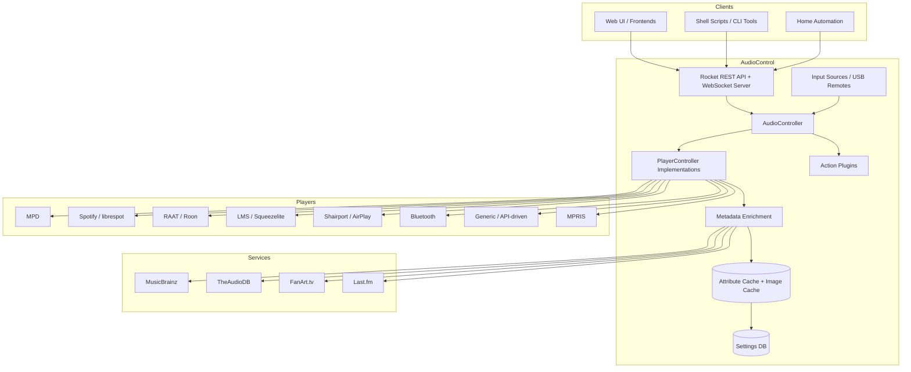

# AudioControl Architecture

This document describes the purpose, high-level structure, and runtime flow of the AudioControl (Audiocontrol) service. It is intended for developers, integrators, and administrators who want to understand how the system fits together.

## Purpose

AudioControl is the next-generation audio control software for HiFiBerry devices. It replaces the earlier Python-based [audiocontrol2](https://github.com/hifiberry/audiocontrol2) with a Rust implementation that uses static typing, a trait-based player abstraction, and explicit concurrency management to improve reliability and maintainability.

At its core, AudioControl is a **multi-source audio controller**:

- It manages several physical or logical audio players (MPD, Spotify/librespot, RAAT/Roon, LMS/squeezelite, AirPlay/shairport, Bluetooth, MPRIS, generic API-driven players).
- It exposes a single, unified REST and WebSocket API so that frontends and automation tools can control playback, query state, and browse libraries without knowing which player is currently active.
- It enriches now-playing metadata using online services such as MusicBrainz, TheAudioDB, FanArt.tv, and Last.fm.
- It caches data locally in SQLite and on disk, stores user settings, and provides input handling for USB HID remotes and keyboards.

## High-Level Architecture

The architecture is built around a few central abstractions:

- **`PlayerController`** trait: every supported player backend implements this common interface. It exposes capabilities, current song, playback state, queue, loop/shuffle settings, and accepts commands.
- **`AudioController`**: a singleton that owns a list of `PlayerController` instances and tracks which one is currently active. Most API calls are delegated to the active player.
- **REST/WebSocket server**: a Rocket-based HTTP server that exposes the active player and library state and accepts commands.
- **Helper services**: metadata enrichment, cover-art providers, caching, settings storage, volume control, input handling, and background jobs.

## Startup Flow

When the `audiocontrol` binary starts, it performs the following steps (see [`src/main.rs`](../src/main.rs)):

1. **Initialize the global Tokio runtime** for async work.
2. **Parse command-line arguments** (`-c <config>`, `--log-config`, `--debug`, `--help`, `--check-secrets`).
3. **Initialize logging** from the configured logging JSON file; fail fast if logging cannot be configured.
4. **Load `audiocontrol.json`** from the path supplied with `-c`, the current directory, or (when installed) `/etc/audiocontrol/audiocontrol.json`.
5. **Merge player includes** from the `players.d/` directory next to the main configuration file. Per-package player definitions are loaded here.
6. **Initialize persistent subsystems**:
   - Security store (`secrets/security_store.json` or configured path) for encrypted credentials.
   - Attribute cache (`/var/lib/audiocontrol/cache/attributes.db`).
   - Image cache (`/var/lib/audiocontrol/cache/images`).
   - Settings database (`/var/lib/audiocontrol/db`).
7. **Initialize external service integrations**: MusicBrainz, TheAudioDB, FanArt.tv, Last.fm, Spotify, global volume control, and genre cleanup.
8. **Register cover-art providers**: Spotify, Last.fm, TheAudioDB, FanArt.tv.
9. **Create the `AudioController`** from the `players` array in configuration. Each player is constructed by the factory in [`src/players/player_factory.rs`](../src/players/player_factory.rs). Disabled or underscore-prefixed players are skipped.
10. **Start input sources** such as USB HID remotes and keyboards.
11. **Start the active player** through the `PlayerController` interface.
12. **Start the Rocket REST/WebSocket server** on the configured host/port (default `0.0.0.0:1080`).
13. **Block the main thread** until `Ctrl+C` is received, then exit.

## Configuration Structure

Configuration supports both the new `services` subtree and the legacy top-level structure for backward compatibility. Service-specific settings are read through `config::get_service_config`.

Typical sections:

| Section | Purpose |
|---------|---------|
| `webserver` | Host, port, static file routes, API prefix (`/api`). |
| `players` / `players.d/` | Player backend definitions. Legacy built-in player types have moved to per-package include files. |
| `services.spotify` / `spotify` | OAuth configuration and API enablement. |
| `services.lastfm` / `lastfm` | Last.fm credentials and scrobbling settings. |
| `services.musicbrainz` / `musicbrainz` | Enable/disable lookups and rate limits. |
| `services.theaudiodb` / `theaudiodb` | TheAudioDB API key. |
| `services.fanarttv` / `fanarttv` | FanArt.tv API key. |
| `datastore` | Paths for attribute and image caches. |
| `settingsdb` | Path for the user settings database. |
| `security_store` | Path for encrypted credentials. |
| `inputs` | USB HID remote and keyboard configuration. |
| `action_plugins` | Optional event-driven plugins. |
| `genre_cleanup` | Genre normalization and mapping rules. |

For paths and file locations, see the [main README](../README.md).

## Runtime Data Flow

### Player State Changes

1. A backend player (e.g. MPD, librespot, RAAT) detects a change: new song, state change, position update, etc.
2. The corresponding `PlayerController` updates its internal state.
3. The `AudioController` delegates read requests (now-playing, queue, state) to the active player.
4. The REST API serializes the active player's state for clients.
5. The WebSocket server broadcasts the event to subscribed clients.

### Command Flow

1. A client sends a command via `POST /api/player/<name>/command` or a related endpoint.
2. The REST route resolves the target player and calls `AudioController` or the specific `PlayerController`.
3. The player backend translates the abstract `PlayerCommand` into a concrete action (e.g. an MPD command, a librespot/systemd action, a RAAT pipe write, a generic API event).
4. The resulting state change follows the player-state flow above.

### Metadata Enrichment Flow

1. A player reports a new song with core metadata (title, artist, album, URI, duration, cover URL).
2. The metadata subsystem starts with the artist name and looks up:
   - MusicBrainz artist ID(s) (cached).
   - TheAudioDB artist images and biography (by MBID, cached).
   - FanArt.tv artist images (by MBID, cached).
   - Last.fm tags, biography, and images (by artist name, cached).
3. Artist-name splitting handles collaborations and featured artists.
4. Cover-art providers merge results from multiple services, and images are cached on disk.
5. Enriched metadata is exposed through the API and stored in the attribute cache.

### Input Flow

1. The `inputs` module builds configured `InputController`s (currently `keyboard`, which covers USB HID remotes and keyboards via evdev).
2. Raw key events are mapped to abstract `Action`s (`volume_up`, `playpause`, `next`, etc.).
3. `ActionSink` dispatches actions to the global volume control or the active player.
4. Volume actions repeat when a key is held; transport actions fire once per press.

## Component Map

| Source Directory | Responsibility |
|------------------|----------------|
| [`src/audiocontrol/`](../src/audiocontrol/) | The `AudioController` singleton and the event bus used for inter-component messaging. |
| [`src/players/`](../src/players/) | `PlayerController` trait, player factory, and backend implementations (MPD, RAAT, librespot, LMS, shairport, Bluetooth, MPRIS, generic, null). |
| [`src/api/`](../src/api/) | Rocket routes, WebSocket event manager, and route modules for players, library, cover art, volume, settings, etc. |
| [`src/data/`](../src/data/) | Core domain types: `Song`, `Track`, `Album`, `Artist`, `PlaybackState`, `PlayerCommand`, `LoopMode`, `Identifier`, etc. |
| [`src/helpers/`](../src/helpers/) | External service clients, caching, cover art, image grading, metadata enrichment, volume control, security store, settings DB, favourites, lyrics, and more. |
| [`src/inputs/`](../src/inputs/) | USB HID remote/keyboard input handling and action dispatch. |
| [`src/plugins/`](../src/plugins/) | Plugin trait and action plugin factory. |
| [`src/config.rs`](../src/config.rs) | Configuration loading, backward compatibility helpers, and `players.d/` merging. |
| [`src/logging.rs`](../src/logging.rs) | Logging initialization. |
| [`src/secrets.rs`](../src/secrets.rs) | Secret/key loading. |
| [`src/tools/`](../src/tools/) | Standalone CLI utilities such as `acr_send_update`, `acr_player_event_client`, `acr_notify_librespot`, `acr_musicbrainz_client`, `acr_input_devices`, and cache dump tools. |

## Player Backends

| Player | Mechanism | Notes |
|--------|-----------|-------|
| `mpd` | MPD protocol over TCP | Full library browsing, queue, cover-art extraction, metadata enhancement. |
| `raat` | Named pipes (`metadata_pipe`, `control_pipe`) | Roon Bridge / RAAT integration; optional systemd unit check. |
| `librespot` | Monitors librespot process + systemd | Receives events via the librespot `--onevent` hook or the Spotify Connect API. |
| `lms` | JSON-RPC to Logitech Media Server | Library browsing and playback control. |
| `shairport` | Shairport Sync metadata pipe / MQTT | AirPlay playback state. |
| `bluetooth` | Bluetooth device monitoring | Basic playback state for paired A2DP devices. |
| `mpris` | D-Bus MPRIS (Linux/Unix only) | Generic D-Bus media player control. |
| `generic` | API events only | Fully controlled through `POST /api/player/<name>/update`; useful for custom integrations. |
| `null` | No-op | Test/dummy player. |

## API Surface

- Base URL: `http://<device>:1080`
- API prefix: `/api`
- Endpoints cover version, players, queue, library, volume, inputs, cover art, settings, Last.fm, Spotify, lyrics, M3U playlists, cache stats, background jobs, and genre configuration.
- Real-time events are delivered via WebSocket at `/api/events` and per-player `/api/player/<name>/events`.
- Static files can be mounted under configurable URL paths for bundled web frontends.

See [api.md](api.md) and [websocket.md](websocket.md) for endpoint and message details.

## Concurrency Model

- A single global Tokio runtime handles async I/O (HTTP server, external API calls, WebSockets).
- Player state is protected with `parking_lot` `RwLock`s inside `Arc` references.
- The `AudioController` singleton uses `std::sync::OnceLock` for safe lazy initialization.
- Input sources run on their own threads and dispatch actions through an `ActionSink`.
- External service lookups use rate limiters to respect third-party API guidelines.

## Related Documentation

- [API Documentation](api.md)
- [WebSocket API](websocket.md)
- [Caching](caching.md)
- [Metadata Management](metadata.md)
- [Library Management](library.md)
- [Input Sources](inputs.md)
- [Generic Player Controller](generic_player_controller.md)
- [Player Event Client](player_event_client.md)
- [CLI Tools](cli_tools.md)
- [Systemd Integration](systemd_integration.md)
- [Spotify Integration](spotify.md)
- [Last.fm Integration](lastfm.md)
